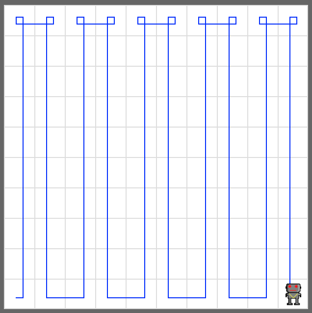

# Zigzag

Write a code that makes your robot in a zigzag pattern in the default 10×10 world. 

Create a default world, add a robot, and make the robot visit the entire world in a zigzag pattern exactly like in the example below.

## Example

<em>Move your robot exactly like this</em>

## Exercise

<iframe class="u-pad-embed" src="../pads/zigzag/
exercise_embed/" frameborder="0"></iframe>
