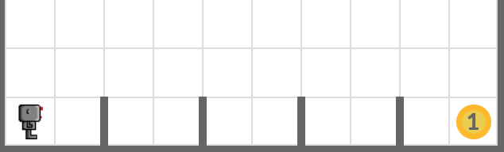
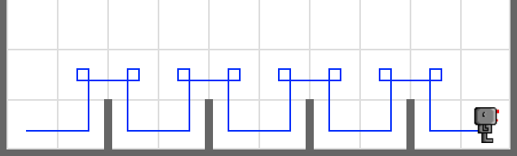

# Hurdles

Load the world named **hurdles1.wld**, add a robot, and let your robot jump over the hurdles and pick up the beeper in the world. 

## Tip

Use `load_world('world_file_path')` function to load a custom world. You can click *Files* button at the bottom of this box to see files available in this exercise. 

In this exercise, use **hurdles1.wld** under the **worlds** folder like this:

```python
load_world('worlds/hurdles1.wld')
```



## Example


<em>Move your robot exactly like this</em>

## Exercise

<iframe class="u-pad-embed" src="../pads/hurdles/exercise_embed/" frameborder="0"></iframe>

## Solution

<a class="c-button" href="../02-2-hurdles-solution">View Solution</a>