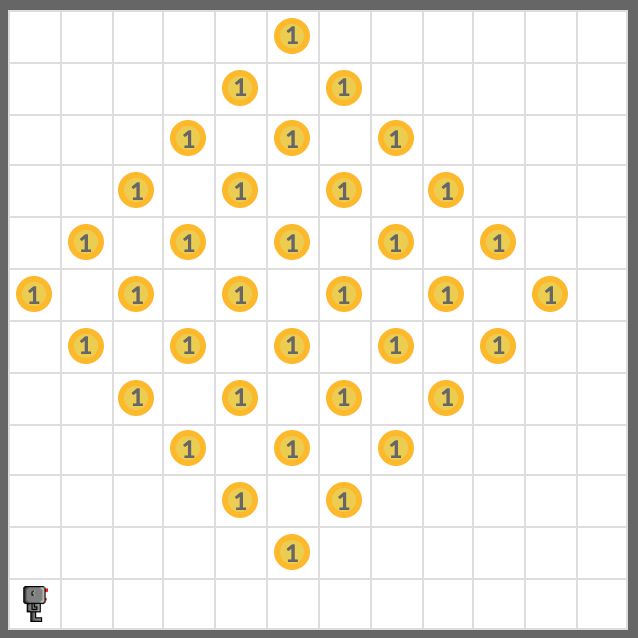
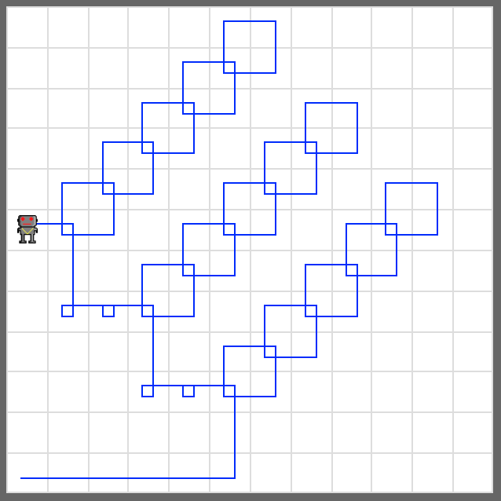

# Harvest Again

Load the world named **harvest2.wld**, and add a robot. Pick up all beepers in the world witih your robot again in this world.

Try to move your robot as little as possible to pick up all beepers.

## Example

<em>Pick up all beepers in the world</em>

## Exercise

<iframe class="u-pad-embed" src="../pads/harvest-again/exercise_embed/" frameborder="0"></iframe>

## Solution

<a class="c-button" href="../02-5-harvest-again-solution">View Solution</a>