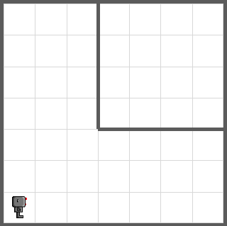
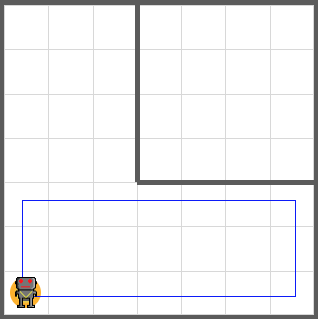
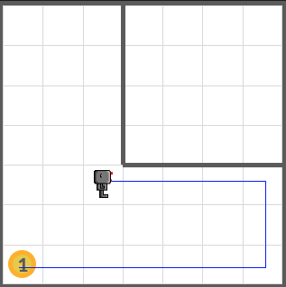
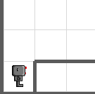
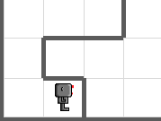

# While-loops

A **for**-loop repeats some instructions a fixed number of times. 

A **while**-loop repeats instructions as long as some condition is true.

Go forward until we reach a beeper:

```python
while not bot.on_beeper(): 
    bot.move()
```

## Around the world in 80 days

Let's write a program to let the robot walk around the boundary of the world until he comes back to the starting point.

Solution outline:

1. Put down a beeper to mark starting point
2. Move forward until facing wall
3. Turn left
4. Repeat steps 2 and 3 until we find the beeper 
5. Finish when we found the beeper

This would be written as a Python code like this:

```python
bot.drop_beeper()
while not bot.on_beeper():
    if bot.front_is_clear(): 
        bot.move()
    else:
        bot.turn_left()
```

However, it doesn't work!

Your robot will never move, because the condition `not bot.on_beeper()` is `False` from the beginning. Your robot just dropped a beeper, so of course the robot is on a beeper!

```python
bot.drop_beeper()
bot.move() # ← We need this here to make bot.on_beeper() false 
while not bot.on_beeper():
    if bot.front_is_clear(): 
        bot.move()
    else:
        bot.turn_left()
```

## What if the world looks like this?



Try the code above, then you'll see that the code doesn't work for this world.



Sometimes we need right turns.

```python
bot.drop_beeper()
bot.move() 
while not bot.on_beeper():
    if bot.right_is_clear():
        turn_right()
    elif bot.front_is_clear(): 
        bot.move()
    else:
        bot.turn_left()
```

However, this can go into an **inifinite loop!**



`bot.right_is_clear()` is true, no matter how many times you turned your robot right at that location. Your robot will keep spinning at that position. Forever.

Let's move the robot after using `turn_right()`. 

```python
bot.drop_beeper()
bot.move() 
while not bot.on_beeper():
    if bot.right_is_clear():
        turn_right()
        bot.move() # ← We need this to prevent an infinite loop.
    elif bot.front_is_clear(): 
        bot.move()
    else:
        bot.turn_left()
```

Still does not work when there is a wall in front of the starting position!



```python
bot.drop_beeper()
if not bot.front_is_clear():
    bot.turn_left() # ← Turn left to avoid the wall!
bot.move() 
while not bot.on_beeper():
    if bot.right_is_clear():
        turn_right()
        bot.move() 
    elif bot.front_is_clear(): 
        bot.move()
    else:
        bot.turn_left()
```

Fixed! But still has a problem if not starting at the bottom left position.



```python
bot.drop_beeper()
# ↓ Turn left again and again until there is no wall!
while not bot.front_is_clear(): 
    bot.turn_left() 
bot.move() 
while not bot.on_beeper():
    if bot.right_is_clear():
        turn_right()
        bot.move() 
    elif bot.front_is_clear(): 
        bot.move()
    else:
        bot.turn_left()
```

Fixed!

## Write code for humans

One of the secrets of writing good, correct, elegant programs is to write them as if you wrote them for a **human** reader, not a computer. 

Let’s clean up our program:

```python
# This program lets the robot go around his world counter-
# clockwise, stopping when he returns to the starting point. from cs1robots import *

load_world('amazing5')
hubo = Robot(beepers = 1)

def turn_right(): 
    for i in range(3): 
        hubo.turn_left()

def mark_starting_point_and_move(): 
    hubo.drop_beeper()
    while not hubo.front_is_clear():
        hubo.turn_left()
    hubo.move()

def follow_right_wall():
    if bot.right_is_clear():
        # keep to the right
        turn_right()
        bot.move() 
    elif bot.front_is_clear(): 
        # move following the right wall
        bot.move()
    else:
        # follow the wall
        bot.turn_left()

# end of definitions, begin solution

mark_starting_point_and_move()

while not hubo.on_beeper(): 
    follow_right_wall()
```

## Stepwise refinement

Steps to follow when writing a program:

- start simple;
- introduce small changes, one at a time;
- **make sure** that each change does not invalidate the work
you have done before;
- add appropriate comments (not just repeating what the
instruction does);
- choose descriptive names.