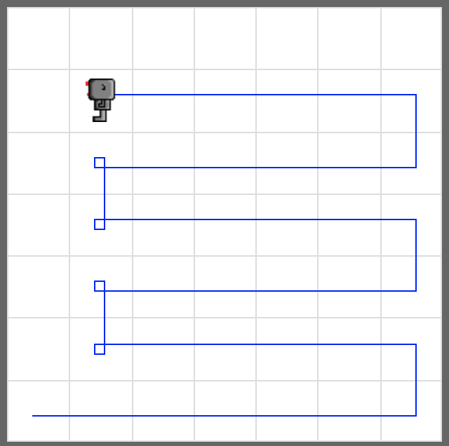

# Harvest More

Write a code to make your robot pick up all beepers in the world **harvest3.wld**. Route of your robot does not matter as long as it picks all beepers up.


## Tip

Modify your code from the task **Harvest Again**, so that the code works for the **harvest3.wld** world.

Use robot's `on_beeper()` function as a condition to check if the robot is on the beeper(s). 
`bot.on_beeper()` is true if there is one or more beepers at the robot's location, or false if there is not. 

```python
if bot.on_beeper():
    do_something_with_the_beeper()
```

## Example



## Exercise

<iframe class="u-pad-embed" src="../pads/harvest-more/
exercise_embed/" frameborder="0"></iframe>