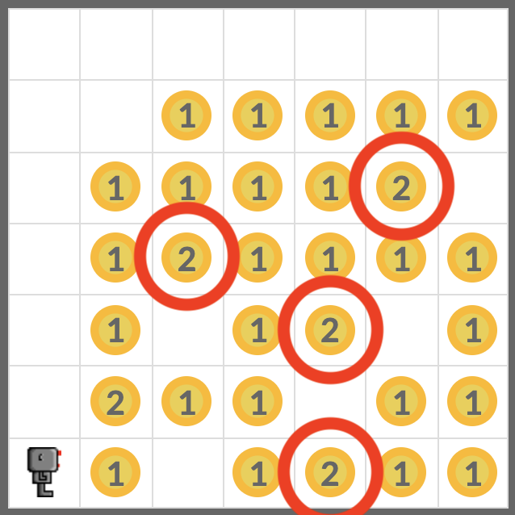
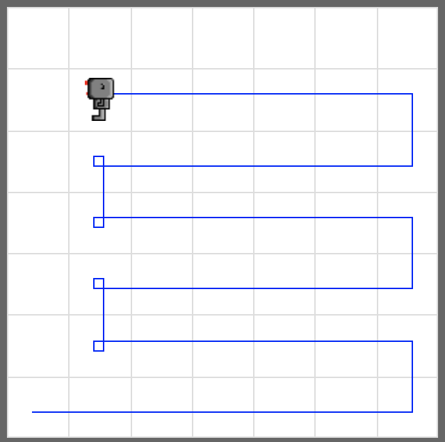

# Harvest Even More

Write a code to make your robot pick up all beepers in a random world. Your code must work for all three worlds below.

- **worlds/harvest1.wld**
- **worlds/harvest3.wld**
- **worlds/harvest4.wld**

<em>harvest4.wld</em>

## Tip

Start from your code for the task **Harvest More**. Modify the code to make your robot pick up all beepers from the world **harvest4.wld**.

Be aware there are spots with more than one beepers. Use while loop with the robot's `pick_beeper()` function to pick up multiple beepers.

## Example

## Exercise

<iframe class="u-pad-embed" src="../pads/harvest-even-more/
exercise_embed/" frameborder="0"></iframe>