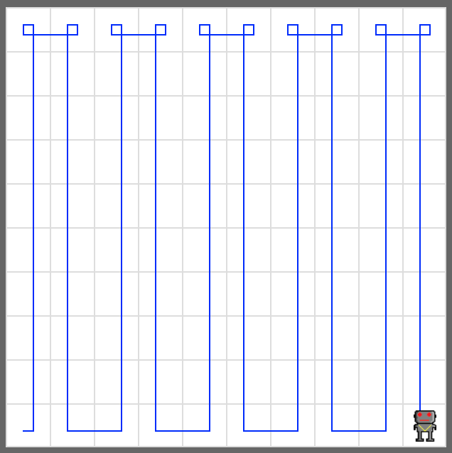

# Zigzag

Write a code that makes your robot in a zigzag pattern in the default 10×10 world. 

Create a default world, add a robot, and make the robot visit the entire world in a zigzag pattern exactly like in the example below.

## Tip

Write `from cs1robots import *` at the beginning of the code to use all functions related to robots.

```python
from cs1robots import *
```

Use `create_world()` function to create a default world.

```python
create_world()
```

Use `bot = Robot()` to create a robot named **bot**.

```python
bot = Robot()
```

Use robot's `move()` function to move robot forward and `turn_left()` function to turn robot left 90 degrees.

```python
bot.move()
bot.turn_left()
```

## Example


<em>Move your robot exactly like this</em>

## Exercise

<iframe class="u-pad-embed" src="../pads/zigzag/exercise_embed/" frameborder="0"></iframe>

## Solution

<a class="c-button" href="../02-1-zigzag-solution">View Solution</a>