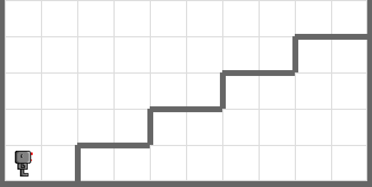
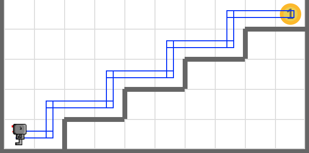

# Newspaper Delivery

Write a code that makes your robot delivers a beeper and return to its starting point. Load the world named **newspaper.wld** to do this.



## Tip

Use `load_world('world_file_path')` function to load a custom world. 

```python
load_world('worlds/newspaper.wld')
```

Use `Robot(beeper=10)` to create a robot with 10 beepers.

```python
bot = Robot(beeper=10)
```

## Example


<em>Move your robot exactly like this</em>

## Exercise

<iframe class="u-pad-embed" src="../pads/newspaper/exercise_embed/" frameborder="0"></iframe>

## Solution

<a class="c-button" href="../02-3-newspaper-solution">View Solution</a>