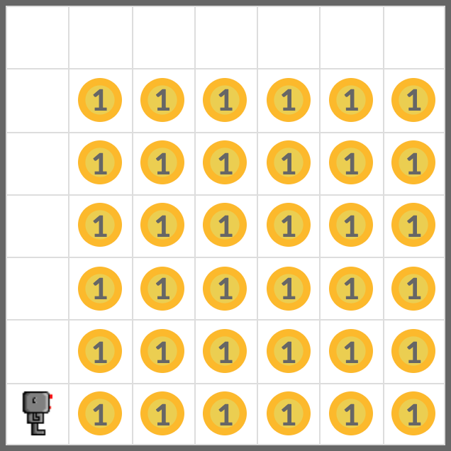
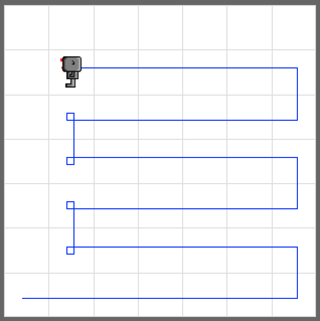

# Harvest

Load the world named **harvest1.wld**, and add a robot. Pick up all beepers in the world witih your robot.



## Tip

Use robot's `pick_beeper()` function to pick up beeper at the current position. Be aware that this function will cause error if there is no beeper at the position.

```python
bot.pick_beeper()
```

## Example


<em>Pick up all beepers in the world</em>

## Exercise

<iframe class="u-pad-embed" src="../pads/harvest/exercise_embed/" frameborder="0"></iframe>

## Solution

<a class="c-button" href="../02-4-harvest-solution">View Solution</a>