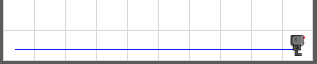

# Conditionals

So far, our programs performed exactly the same steps every time the program is run.

Often, what the robot does must depend on the environment:

```python
if it_rains: 
    listen_to_cs101_lecture()
else: 
    eat_strawberries_in_the_sun()
```

A conditional statement allows you to do that.

```python
if it_rains: # ← condition
    listen_to_cs101_lecture() # ← if condition is true, do this
else: 
    eat_strawberries_in_the_sun() # ← if condition is false, do that
# ↑ Note the indentation!
```

A **condition** is something that is either `True` or `False`.

This will always print the message *"CS101 is my favorite course"*:

```python
if True:
    print('CS101 is my favorite course')
```

And this will **never** print the message *"Every CS101 student will receive an A+"*:

```python
if False:
    print('Every CS101 student will receive an A+')
```

This will print the message *"3 is less than 5"* because the **condition** `3 < 5` is true. 3 is smaller than 5.

```python
if 3 < 5:
    print('3 is less than 5')
else:
    print('3 is larger than 5')
```

## Sensing beepers

We want the robot to make 9 steps and pick up all beepers on the way.




`bot.pick_beeper()` causes an error if there is no beeper.

To avoid the error, we can repeat the folowing 9 times:

- Take a step forward.
- Check if there is a beeper. 
- If yes, pick it up.

This would be converted in to Python code like this:

```python
def move_and_pick(): 
    bot.move()
    if bot.on_beeper():
        bot.pick_beeper()

for i in range(9):
    move_and_pick()
```

## Not true is false

Let’s do the opposite: we want to drop a beeper, but only if there is **no** beeper at the current location.

```python
if not bot.on_beeper(): 
    bot.drop_beeper()
```

The keyword **not** inverts the sense of the condition: **not** true is false, and **not** false is true.

What would be the output of this Python code?

```python
print(not 3 < 5)
```

`False`. Of course.


