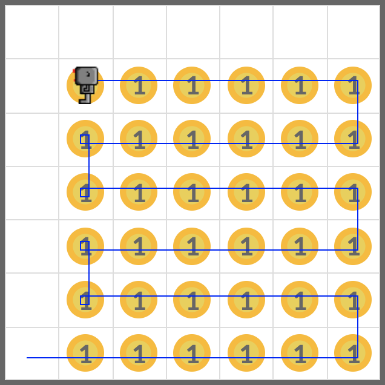

# Plant

Drop the beepers in the world **harvest3.wld**. See the before and after images in the Example section below.

The world should look like **harvest1.wld** after your code worked on the world.

Start with the **harvest3.wld** file.

Route of your robot does not matter as long as it drops the beepers in the correct places.

## Example

## Exercise

<iframe class="u-pad-embed" src="../pads/plant/
exercise_embed/" frameborder="0"></iframe>
