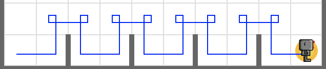
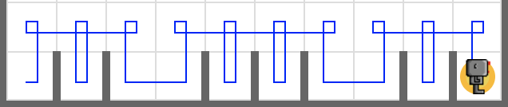

# Smart Hurdles

Write a code that makes a robot, and let the robot jump over random number of multiple hurdles until it meets a beeper.

Your code must work for all three worlds below.

- **worlds/hurdles1.wld**
- **worlds/hurdles2.wld**
- **worlds/hurdles3.wld**

## Tip

Write a function `jump_one_hurdle()` that make your robot jumps over one hurdle.

Using `jump_one_hurdle()`, write a code that makes your robot jumps over all hurdles it faces and stops when it steps on the beeper.

To make your robot jumps over random number of multiple hurdles, use a while loop instead of using a for loop.

## Example

<em>hurdles1.wld</em>

<em>hurdles2.wld</em>

<em>hurdles3.wld</em>

## Exercise

<iframe class="u-pad-embed" src="../pads/smart-hurdles/
exercise_embed/" frameborder="0"></iframe>

## Solution

<a class="c-button" href="../04-3-smart-hurdles-solution">View Solution</a>
