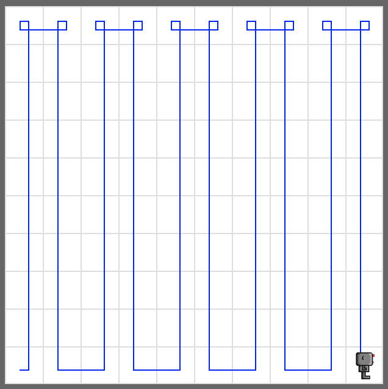
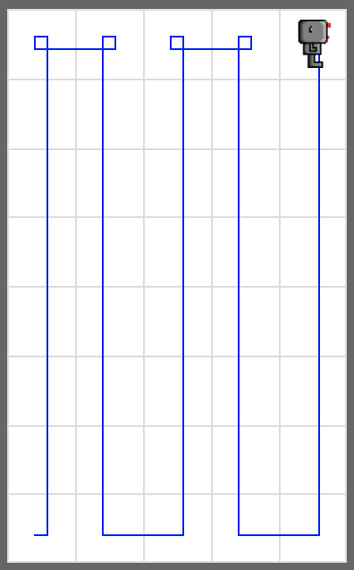
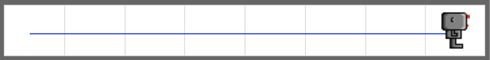
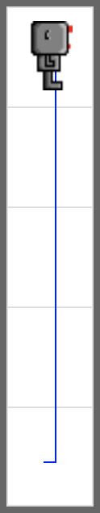

# Smart Zigzag

Rewrite your code for the task **Zigzag**, so that your robot move in a zigzag pattern in any given empty world of random size.

Your code must work for all sizes of empty worlds, except a 1x1 world.

## Example

<em>A 10x10 world</em>
  

<em>A 5x8 world</em>
  

<em>A 8x1 world</em>
  

<em>A 1x5 world</em>

## Exercise

<iframe class="u-pad-embed" src="../pads/smart-zigzag/
exercise_embed/" frameborder="0"></iframe>
