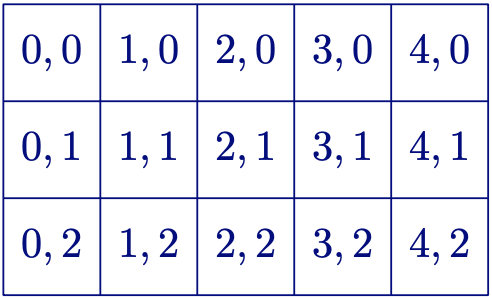
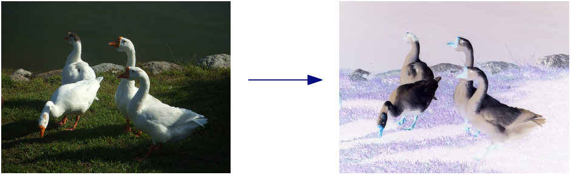

# Media

A digital image of width `w` and height `h` is a rectangular matrix with `h` rows and `w` columns:



We access pixels using their `x` and `y` coordinates. `x` is between 0 and `w-1`, `y` is between 0 and `h-1`.

```python
print(img.get(250, 188))
# ↑ this will print (101, 104, 51)
# this is a red, green, blue triple
red = (255, 0, 0) # ← this is also a red, green, blue triple
img.set(250, 188, red)
```

## For-loops

A for-loop assigns integer values to a variable:

```python 
for i in range(4):
  print(i)
```

The code above prints 0, 1, 2, 3.

```python
for i in range(7):
    print("*" * i)
```

The code above will print:

```

*
**
***
****
*****
******
```

## Negative of a photo

This code turns a photo into a negative of the photo:

```python
from cs1media import *

img = load_picture("../photos/geese.jpg") 
w, h = img.size()
for y in range(h):
    for x in range(w):
        r, g, b = img.get(x, y)
        r, g, b = 255 - r, 255 - g, 255 - b 
        img.set(x, y, (r, g, b))
img.show()
```



## Black & white photo

This code turns a photo into a black & white photo:

```python
from cs1media import *
threshold = 100
white = (255, 255, 255)
black = (0, 0, 0)

img = load_picture("../photos/geese.jpg") 
w, h = img.size()
for y in range(h):
    for x in range(w):
        r, g, b = img.get(x, y)
        v = (r + g + b) // 3
        if v > threshold:
            img.set(x, y, white)
        else:
            img.set(x, y, black)
img.show()
```
