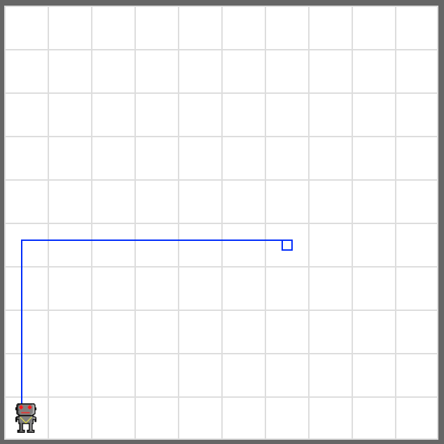

# Return

Write a code that makes your robot moves to its usual starting position (at the bottom left corner), no matter where the robot is currently located at.

Initialize your robot with a random starting position and direction to test your code.

```python
bot = Robot(orientation='W', avenue=7, street=5)
```

Your program should work with any orientation, avenue, and street value. The route of your robot does not matter.

## Tip

Use robot's `facing_north()` function to check if the robot is currently facing north
or not.

```python
if bot.facing_north():
    something_to_do_when_facing_north()
```

## Example


<em>No matter where the robot is created, it should return to the bottom left corner</em>

## Exercise

<iframe class="u-pad-embed" src="../pads/return/
exercise_embed/" frameborder="0"></iframe>

## Solution

<a class="c-button" href="../02-1-return-solution">View Solution</a>
