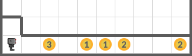
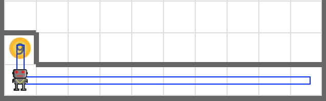

# Trash 1

Use your robot to collect the beepers. Pick all beepers in the world and drop them all in the trash can (one step toward north from the bottom left corner).

Your code must work in world files below.

- **worlds/trash1.wld**
- **worlds/trash2.wld**



## Tip

Use carries_beepers() function of your robot to dump all trash.

```python
if bot.carries_beepers():
    ...
```

## Example



## Exercise

<iframe class="u-pad-embed" src="../pads/trash1/
exercise_embed/" frameborder="0"></iframe>

## Solution

<a class="c-button" href="../02-2-trash1-solution">View Solution</a>
