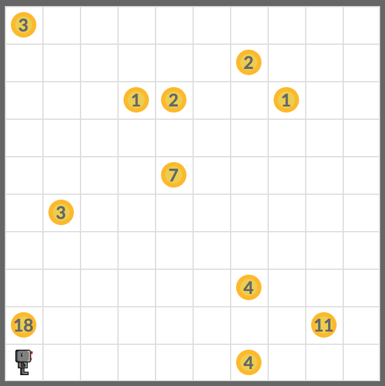
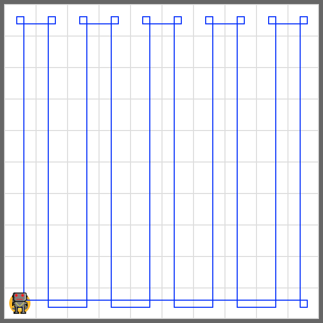

# Trash 2

Use your robot to collect the beepers in the world. Bring them back and drop them all at the starting position.

Your program should work in worlds with various sizes and beepers dropped in various patterns in the world.

Your code must work in world files below.

- **worlds/trash3.wld**
- **worlds/trash4.wld**

## Tip

Use your code from the task **Smart Zigzag** and **Return**.

## Example

## Exercise

<iframe class="u-pad-embed" src="../pads/trash2/
exercise_embed/" frameborder="0"></iframe>

## Solution

<a class="c-button" href="../02-3-trash2-solution">View Solution</a>
