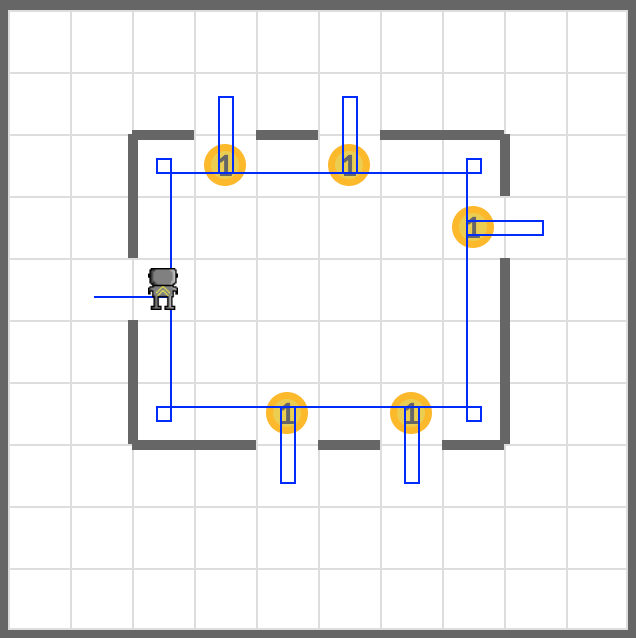
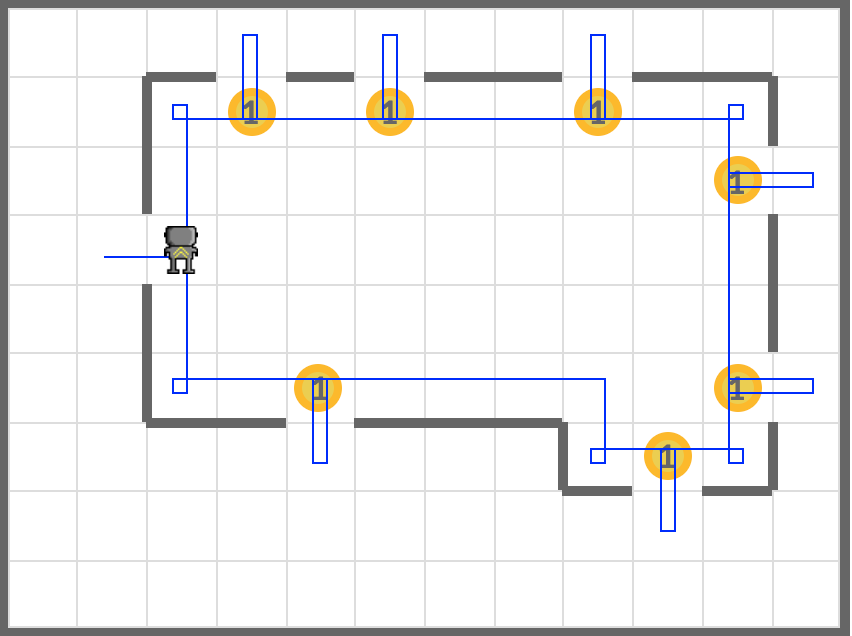

# Rain

Help your robot close all the windows in the house.

Initialize your robot with many beepers to use when closing windows, at the entrance of the house.

```python
bot = Robot(beepers=100, avenue=2, street=6, orientation='E')
```

Your code must work in world files below.

- **worlds/rain1.wld**
- **worlds/rain2.wld**

Drop the beepers next to the openings of the box at the center of the given world, exactly like in examples. The starting point is the entrance of the *house*. Please don't leave the beeper there.

## Examples


<em>rain1.wld</em>


<em>rain2.wld</em>

## Exercise

<iframe class="u-pad-embed" src="../pads/rain/
exercise_embed/" frameborder="0"></iframe>

## Solution

<a class="c-button" href="../02-4-rain-solution">View Solution</a>

