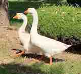
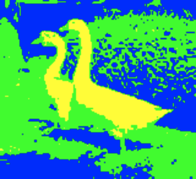

# Color Poster

You are given a program that reads an image file using `cs1media` library and converts it into a black & white poster. 

Modify the program to make it reads an image file and converts it into a three-color poster.

- Turn all bright pixels **yellow**.
- Turn all dark pixels **blue**.
- Turn all other pixels **green**.

Consider the pixels with colors where **average value** of red, green, and blue values is **greater than or equal to 200** as **bright pixels**, and pixels with colors where **average value** of red, green, and blue values is **less than 100** as **dark pixels**.

- **Yellow** color should be a combination of **255, 255, and 0** for red, green, and blue respectively. 
- **Blue** should be a combination of **0, 0, and 255**.
- **Green** should be a combination of **0, 255, and 0**.

Load the `images/ducks.jpg` file and convert this to a three-color poster.

## Example

### Before

### After

## Exercise

<iframe class="u-pad-embed" src="../pads/color-poster/
exercise_embed/" frameborder="0"></iframe>

## Solution

<a class="c-button" href="../02-5-color-poster-solution">View Solution</a>

