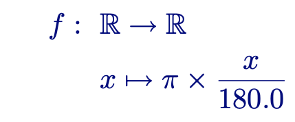
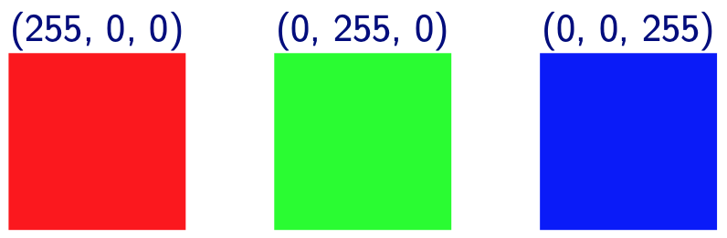

# Return Values and Parameters

The name **function** comes from mathematics. A function is a mapping from one set to another set:



Here, *x* is the **argument** of the function, *f(x)* is the **result** of the function.

In Python, functions also take **arguments** and return a **result**:

```python
def to_radians(deg):
    return (deg / 180.0) * math.pi
```

```python
a = to_radians(90)
print(a) 
# 1.5707963267948966
```

## Useful functions

Python comes with many built-in functions.

Type conversion functions convert from one type to another type:

```python
v1 = int("32")
# v1 is 32
v2 = int(17.3)
# v2 is 17
v3 = float(17)
# v3 is 17.0
v4 = float("3.1415")
# v4 is 3.1415
v5 = str(17) + " " + str(3.1415)
# v5 is '17 3.1415'
```

## Math functions

To use math functions, we need to tell Python that we want to use the math module:

```python
import math

degrees = 45
radians = degrees / 360.0 * 2 * math.pi 
print(math.sin(radians))
print(math.sqrt(2) / 2)
```

When using math functions often, we can use shorter names:

```python
import math

sin = math.sin
pi = math.pi

radians = degrees / 360.0 * 2 * pi 
print(sin(radians))
```

## Defining functions with parameters

The function definition uses **names** for the arguments of the function. These names are called **parameters**:

```python
def compute_interest(amount, rate, years):
```

`amount`, `rate`, and `years` from the code above are the **parameters**.

Inside the function, the parameter is just a name:

```python
def compute_interest(amount, rate, years):
    value = amount * (1 + rate/100.0) ** years
```

When we have computed the result of the function, we **return** it from the function. The function ends at this point, and the result object is given back:

```python
def compute_interest(amount, rate, years):
    value = amount * (1 + rate/100.0) ** years
    return value
```

We can now call the function with different argument values:

```python
s1 = compute_interest(200, 7, 1)
print(s1)
s2 = compute_interest(500, 1, 20)
print(s2)
```

## Converting to black and white

What is the light intensity (**luminance**) of pixel `(r,g,b)`?



A good formula is:

```python
def luminance(p):
    r, g, b = p
    return int(0.299 * r + 0.587 * g + 0.114 * b)
```
