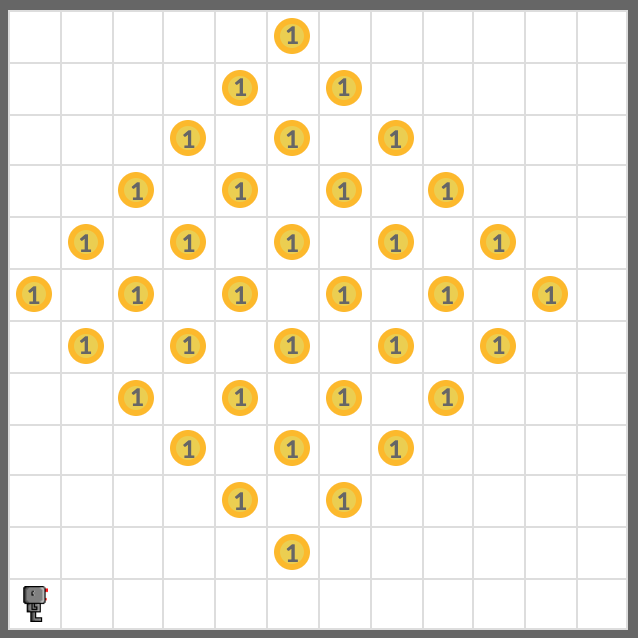
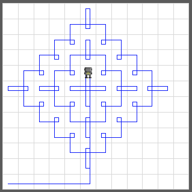
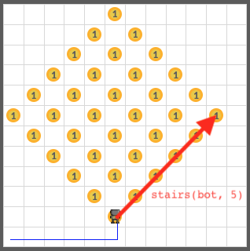
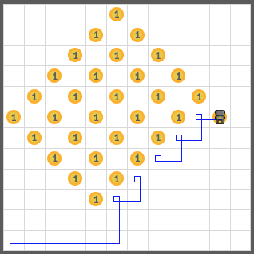
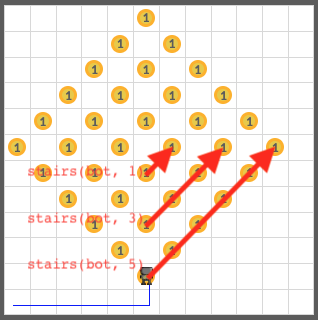
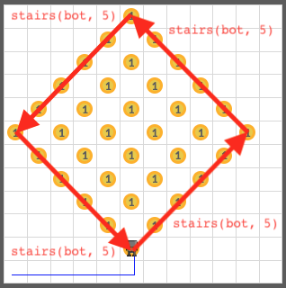
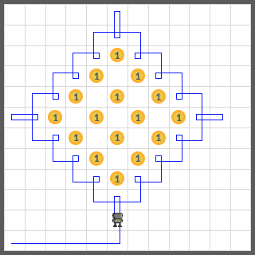

# Harvesting Again

Harvest beepers from the world **harvest2.wld** again.



This time, move your robot like this:



Write a function `stairs(robot, n)` that moves the robot like this:





The function should move according to the `n` value:



Start harvesting the beepers with the ones on the edge. Write a function `diamond(robot, n)` to do this.





And finally, write a function `harvest_all(robot)` to harvest all beepers with the `robot`:

```python
def stairs(robot, n):
    for i in range(n):
        robot.pick_beeper()
        robot.move()
        turn_right(robot)
        robot.move()
        robot.turn_left()

def diamond(robot, n):
    for i in range(4):
        stairs(robot, n)
        robot.turn_left()

def harvest_all(robot): 
    for i in range(3):
        n = 5 - 2 * i 
        diamond(robot, n)
        hubo.move()
        hubo.move()
```

<iframe class="u-pad-embed" src="../pads/harvest-parameters/embed/" frameborder="0"></iframe>
