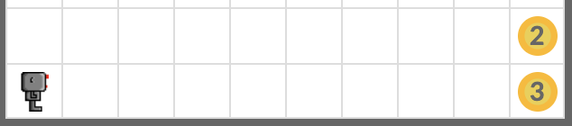
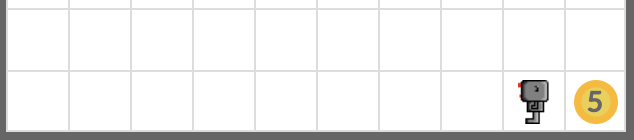
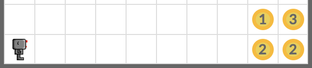
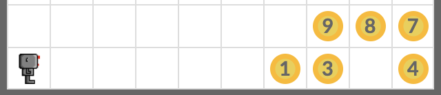

# Addition

Teach your robot how to add two numbers.

There are two numbers written down with beepers on the two rows at the bottom of the given worlds. Make your robot add two numbers and write down the sum of the numbers on the row at the bottom.

Your code must work for all world files below:

- `add1.wld`
- `add2.wld`
- `add34.wld`

## Expected Results

### add1.wld

<em>Before: 2 + 3</em>

<em>After: 5</em>

### add2.wld

<em>Before: 13 + 22</em>

<em>After: 35</em>

### add34.wld

<em>Before: 987 + 1304</em>

<em>After: 2291</em>

## Exercise

<iframe class="u-pad-embed" src="../pads/addition/
exercise_embed/" frameborder="0"></iframe>

## Solution

<a class="c-button" href="../04-1-addition-solution">View Solution</a>
