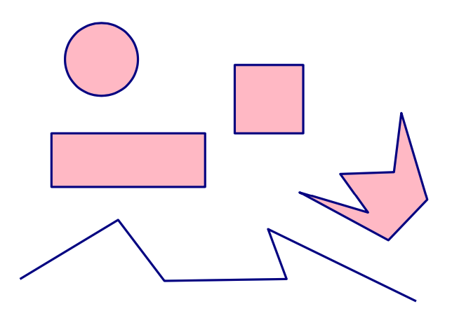

# Graphics

We first need to create a canvas to draw on:

```python
from cs1graphics import *

canvas = Canvas(400, 300)
canvas.setBackgroundColor("light blue")
canvas.setTitle("CS101 Drawing exercise")
```

The coordinate system: *x* goes from 0 to 399 left-to-right, *y* from 0 to 299 top-to-bottom.


## Drawable objects

1. `Circle(radius)`
1. `Square(side)`
1. `Rectangle(width, height)`
1. `Polygon`
1. `Path`
1. `Text(message, font_size) `
1. `Image(image_filename)`



We can set the border color (`color` is a string or an `(r, g, b)` tuple):

```python
obj.setBorderColor(color) 
obj.getBorderColor()
```

For fillable objects like `Circle`, `Square`, `Rectangle`, and `Polygon`, we can set the fill color:

```python
obj.setFillColor(color) 
obj.getFillColor()
```

## Reference point

Every object has a reference point. The location of the reference point on the canvas is set using `move(dx, dy)` and `moveTo(x, y)`.

```python
sq = Square(100)
canvas.add(sq)
sq.setFillColor("blue")
sq.setBorderColor("red")
sq.setBorderWidth(5)
sq.moveTo(200, 200) # ← absolute coordinates
```


We can create an animation using `move(dx, dy)` like this:

```python
for i in range(100):
    sq.move(1, 0)  # ← relative coordinates
```

## Sunrise and sunset

```python
def animate_sunrise(sun): 
    w = canvas.getWidth()
    h = canvas.getHeight()
    r = sun.getRadius()
    x0 = w / 2.0
    y0 = h + r
    xradius = w / 2.0 - r yradius = h
    for angle in range(181):
        rad = (angle/180.0) * math.pi
        x = x0 - xradius * math.cos(rad) 
        y = y0 - yradius * math.sin(rad) 
        sun.moveTo(x, y)
```

## Color interpolation

```python 
def interpolate_colors(t, color1, color2):
    """Interpolate between color1 (for t == 0.0) and color2 (for t == 1.0)."""
    r1, g1, b1 = color1
    r2, g2, b2 = color2
    return (
        int((1-t) * r1 + t * r2),
        int((1-t) * g1 + t * g2),
        int((1-t) * b1 + t * b2)
    )

def color_value(color):
    """Convert a color name to an (r, g, b) tuple.""" 
    return Color(color).getColorValue()
```

## Colorful sunrise and sunset

```python
def animate_sunrise(sun, morning_sun, noon_sun, morning_sky, noon_sky):
    morning_color = color_value(morning_sun) # Color!
    noon_color = color_value(noon_sun) # Color!
    dark_sky = color_value(morning_sky) # Color!
    bright_sky = color_value(noon_sky) # Color!
    w = canvas.getWidth()
    # as before ...
    for angle in range(181):
        rad = (angle/180.0) * math.pi
        t = math.sin(rad) # Color!
        col = interpolate_colors(t, morning_color, noon_color) # Color!
        sun.setFillColor(col) # Color!
        col = interpolate_colors(t, dark_sky, bright_sky) # Color!
        canvas.setBackgroundColor(col) # Color!
        x = x0 - xradius * math.cos(rad)
        y = y0 - yradius * math.sin(rad)
        sun.moveTo(x, y)
```

## Depth

When there are two overlaid objects like this:

```python
r = Rectangle(150, 75)
canvas.add(r)
r.setFillColor("yellow")
r.moveTo(280, 150)
```

Consider setting the depth:

```python
sq.setDepth(10)
r.setDepth(20)
```

Objects with smaller depth appear in foreground.


## Rotating, scaling, and flipping

We can rotate an object around its reference point:

```python
sq.rotate(45)
```


Scaling makes an object smaller or larger:

```python
sq.scale(1.5)
r.scale(0.5)
```


Fade-out:

```python
for i in range(80): 
    sq.scale(0.95)
canvas.remove(sq)
```
 
Flipping mirrors an object around an axis.

## Layers

A layer groups together several graphic objects so that they can be moved and transformed as a whole:

```python
car = Layer()
tire1 = Circle(10, Point(-20,-10))
tire1.setFillColor(’black’)
car.add(tire1)
tire2 = Circle(10, Point(20,-10))
tire2.setFillColor(’black’)
car.add(tire2)
body = Rectangle(70, 30, Point(0, -25))
body.setFillColor(’blue’)
body.setDepth(60)
car.add(body)
```


Move the car layer to animate the car:

```python
for i in range(250): 
    car.move(2, 0)
```

## Transformations

The whole layer can be transformed as a single object:

```python
for i in range(50):
    car.move(2, 0)
for i in range(22):
    car.rotate(-1)
for i in range(50):
    car.move(2,-1)
for i in range(22):
    car.rotate(1)
for i in range(50):
    car.move(2,0)
for i in range(10):
    car.scale(1.05)
car.flip(90)
```


